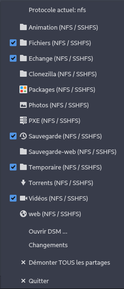

# NAS GUI
Une application qui se loge en zone de notification. 
Elle permet d'un clic droit sur l'icône de pourvoir choisir un partage du NAS à monter. 

Tous les partages sont configurables dans un fichier de configuration situé dans **~/.config/nas-gui.ini**



## Packaging

### Fedora
```sh
cd "packaging/fedora"
fedpkg --release f$(rpm -E %fedora) local
```

### Archlinux
```sh
cd "packaging/PKGBUILD"
makepkg -sifr
```